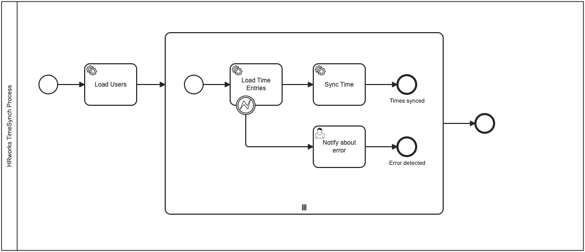

# HRWorks Showcase

This project serves as a showcase for demonstrating the synchronization of times between Clockify and HRWorks using Camunda 7 and following the principles of the Hexagonal Architecture.

## The Process

<p>
   
   <em>This BPMN diagram represents the <b>HRworks TimeSync Process</b> using the Camunda Modeler (exporter version 5.13.0).</em>
</p>

The process involves synchronizing time-related data within the HRworks system. It consists of the following key steps:

1. **Start Event**: The process begins with a start event. This should be changed to a timer start event to trigger automatically at a specific time.

2. **Load Users Service Task**: This external service task named "Load Users" loads user data and related information. The loaded data includes users, employees, and workspace information.

3. **Subprocess - Sync Time Entries for Users**:
    - This subprocess is a multi-instance subprocess, executed asynchronously and in parallel for each user.
    - It contains the following steps:
        - **Start Event**: This event initiates the subprocess for each user.
        - **Load Time Entries Service Task**: This external service task loads time entry data for the user. When an error occurs, the boundary event is triggered.
        - **Sync Time Service Task**: Another external service task syncs the time entries for the user.
        - **Notify about error User Task**: This task notifies the user when a user's time entries failed to load successfully. In our code, we intentionally trigger this error for a user to demonstrate this user task.
        - **End Event**: The subprocess can end with two types of end events:
            - **"Times synced"**: If the time synchronization process completes successfully.
            - **"Error detected"**: If there was an error during the "Load Time Entries"-Task.

4. **End Events**: When the subprocess is terminated, the entire process is also terminated.

### Flow of Execution

1. The process starts with a **Start Event** triggering the **Load Users Service Task**.
2. The loaded user data triggers the subprocess for each user.
3. In the subprocess:
    - **Load Time Entries** service task fetches time entries data for the user.
    - **Sync Time** service task synchronizes the time entries.
    - **Notify about error** user task informs the user about an error in the process.
4. Depending on the outcome, the subprocess concludes with either a successful `Times synced` end event or an `Error detected` end event.

## Quick Start

1. Clone the Repository

   ```shell
   git clone https://github.com/Miragon/hrworks-showcase.git
   cd hrworks-showcase
   ```

2. Build the Project
 
   ```shell
   mvn clean package
   ```

3. Add Environment Variables

   ```shell
   cd timesync-stack
   touch .env
   ```
   
   Add the following environment variables to the `.env` file:

   ```text
   # Clockify
   CLOCKIFY_API_KEY=<API-KEY>
   
   # HRWorks
   HRWORKS_AC_KEY=<ACCESS-KEY>
   HRWORKS_SAC_KEY=<SECRET-ACCESS-KEY>
   ```
   
   > Note: See [Find/Generate Credentials](#findgenerate-credentials) for more information about the credentials.

4. Start the Stack

   ```bash
   cd timesync-stack
   docker compose --profile worker up
   ```

5. Deploy the Artifacts (see [Deploy Artifacts](#deploy-artifacts))

### Accessing Camunda Web Applications

After starting the stack, you can access the Camunda Web Applications using the following URLs:
> Note: The login credentials are `demo` as username and password
* [Camunda Tasklist](http://localhost:8080/camunda/app/tasklist/default/#/?searchQuery=%5B%5D)
* [Camunda Cockpit](http://localhost:8080/camunda/app/cockpit/default/#/dashboard)
* [Camunda Admin](http://localhost:8080/camunda/app/admin/default/#/)

## Deploy artifacts

You can use the [Camunda Modeler](https://camunda.com/de/download/modeler/) to deploy the process.
1. Open the [bpmn file](./timesync/timesync-camunda7/src/main/resources/bpmn/hrworks-timesync.bpmn)
2. Add the [form](./timesync/timesync-camunda7/src/main/resources/.camunda/forms/error.form) to your deployment
 
   
   
3. Click on `Deploy`

## Find/Generate Credentials

The **Clockify API** key can be found on the [Clockify website under "User Settings"](https://app.clockify.me/user/settings).

The **HRWorks Keys** can be generated on the HRWorks admin page at https://ssl1.hrworks.de/demo-a03/HrwScStartView under
"Grundlagen" > "Integration" > "HRWorks-API".

## Development

This project comes with a [run script](.run/TimeSyncCamunda7Application.run.xml) for *IntelliJ IDEA*.
This script expects a `.env` file under [timesync-stack](./timesync-stack) with the following environment variables:

```text
# Clockify
CLOCKIFY_API_KEY=<API-KEY>

# HRWorks
HRWORKS_AC_KEY=<ACCESS-KEY>
HRWORKS_SAC_KEY=<SECRET-ACCESS-KEY>
```

> Note: See [Find/Generate Credentials](#findgenerate-credentials) for more information about the credentials.

If you have obtained the necessary credentials, you can start the stack.

```shell
cd timesync-stack
docker compose up
```

If the stack is running, you can start the application using the run script.

## License

This showcase is licensed under the [MIT License](LICENSE).
